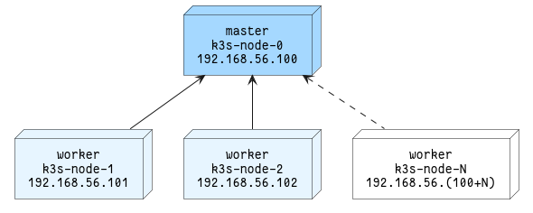

# k3s-sandbox

[](https://unsplash.com/photos/2FaCKyEEtis)

[](https://masterminds.github.io/stability/experimental.html)

> \- You can't solve a problem just by saying techy things.  
> \- Kubernetes.

### Motivation

I just needed a local Kubernetes cluster to play with. I know that one can be
quickly set up with [minikube][minikube], but where is the fun with simple
`minikube start`?

The cluster is going to be used for experiments, so there must be a way to
set it up and tear it down with a single command. So I decided to experiment
with [Vagrant][vagrant] and [Ansible][ansible] to create my very own, naive
[K3s][k3s] three node cluster running inside [VirtualBox][virtualbox].

### Usage 

By default three virtual machines (nodes) will be created - master and two
workers. That count can be changed by setting `WORKERS_COUNT` in `Vagrantfile`, mind that total nodes count is equal to workers count + 1 (as there is always
`k3s-node-0` acting as master).

All nodes are named according to the scheme - `k3s-node-N`, where `N` is the
node number. And IP address assigned to `eth1` network interface attached to
to VirtualBox private network is set to `192.168.56.(100 + N)` (mind that this
addressing scheme may be affected by VirtualBox networking settings).



#### Prerequisites

All was developed and tested on Debian GNU/Linux 11 (bullseye) x86_64, but
I see no reason why it shouldn't work on any other Linux distro. 

Download and install:

- [VirtualBox][virtualbox]
- [Vagrant][vagrant]
- [Ansible][ansible]

#### From nothing to running cluster

It's as simple as calling:

```
vagrant up
```

and waiting few minutes. If the job is dane without any errors, virtual machines
should be created and provisioned. Virtual machines state can be verified with:

```
vagrant status
```

which should return something like:

```
Current machine states:

k3s-node-0                running (virtualbox)
k3s-node-1                running (virtualbox)
k3s-node-2                running (virtualbox)
```

K3s cluster state can be verified by connecting to master node with:

```
vagrant ssh k3s-node-0
```

and executing:

```
kubectl get nodes
```

which should return something like:

```
NAME         STATUS   ROLES                  AGE   VERSION
k3s-node-1   Ready    <none>                 22s   v1.24.4+k3s1
k3s-node-2   Ready    <none>                 21s   v1.24.4+k3s1
k3s-node-0   Ready    control-plane,master   48s   v1.24.4+k3s1
```

#### When the mess creeps in

When something really bad happens to the cluster or you want to start fresh -
everything can be destroyed:

```
vagrant destroy -f
```

and recreated from scratch:

```
vagrant up
```

But destroying and creating virtual machines can take few minutes. If you do
not want to wait that long, and there is no problem with the virtual machine
or guest operating system, but K3s cluster itself it can be quickly purged 
and installed again with Ansible playbooks.

Uninstall K3s with:

```
ansible-playbook -i .vagrant/provisioners/ansible/inventory/vagrant_ansible_inventory reset.yml
```

and install it again with:

```
ansible-playbook -i .vagrant/provisioners/ansible/inventory/vagrant_ansible_inventory site.yml
```

[virtualbox]: https://www.virtualbox.org/
[vagrant]: https://www.vagrantup.com/
[ansible]: https://www.ansible.com/
[minikube]: https://minikube.sigs.k8s.io/docs/
[k3s]: https://k3s.io/